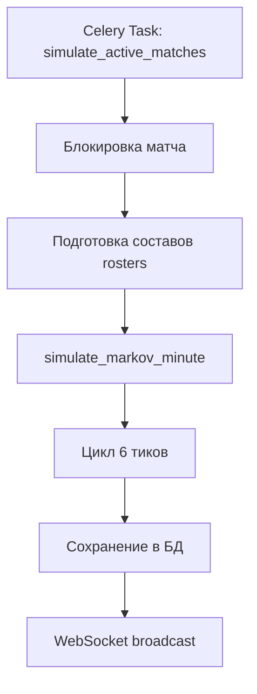
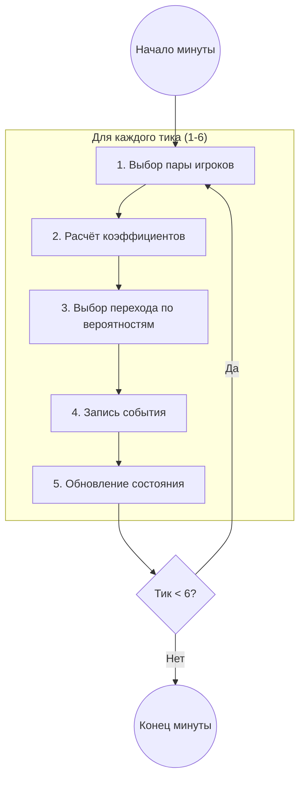
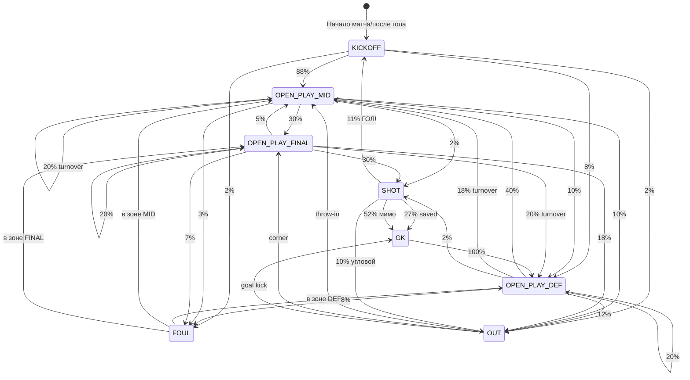

# Диаграмма симуляции одной минуты матча

## 1. Общий поток



## 2. Цикл одной минуты (6 тиков по 10 сек)



## 3. Машина состояний (Markov Chain)



## 4. Упрощённая схема состояний

```
                    ┌─────────────┐
                    │   KICKOFF   │
                    │ (после гола)│
                    └──────┬──────┘
                           │ 88%
                           ▼
┌─────────────┐     ┌─────────────┐     ┌─────────────┐
│ OPEN_PLAY   │◄───►│ OPEN_PLAY   │────►│ OPEN_PLAY   │
│    DEF      │ 40% │    MID      │ 30% │   FINAL     │
│ (защита)    │     │ (центр)     │     │ (атака)     │
└──────┬──────┘     └─────────────┘     └──────┬──────┘
       │                                        │ 30%
       │                                        ▼
       │                                 ┌─────────────┐
       │                                 │    SHOT     │
       │                                 │   (удар)    │
       │                                 └──────┬──────┘
       │                                        │
       │            ┌───────────────────────────┼───────────────┐
       │            │ 11%                       │ 79%           │ 10%
       │            ▼                           ▼               ▼
       │     ┌─────────────┐             ┌─────────────┐  ┌─────────┐
       │     │    GOAL!    │             │     GK      │  │   OUT   │
       │     │  → KICKOFF  │             │ (вратарь)   │  │ (аут)   │
       │     └─────────────┘             └──────┬──────┘  └────┬────┘
       │                                        │              │
       └────────────────────────────────────────┴──────────────┘
                            возврат в игру
```

## 5. Влияние силы команд

```
Базовая вероятность удара: 30%

              Атакующий сильнее                  Защитник сильнее
              (рейтинг 90 vs 70)                 (рейтинг 70 vs 90)
                     │                                   │
                     ▼                                   ▼
            Вероятность удара: ~40%              Вероятность удара: ~22%
```

**Формула:**
```
multiplier = attack_coeff / defense_coeff
new_probability = base_probability × multiplier
```

## 6. Пример одной минуты

```
Минута 25, Home владеет мячом в центре

Тик 1: MID → MID      "Home пасуют в центре"
Тик 2: MID → FINAL    "Home проходят в штрафную"  ← entries_final++
Тик 3: FINAL → SHOT   "Home бьют!"                ← shots++
Тик 4: SHOT → GK      "Мимо ворот"                ← владение к Away
Тик 5: GK → DEF       "Вратарь Away вводит мяч"
Тик 6: DEF → MID      "Away выходят в центр"

Результат: Away владеет в центре, 1 удар, 0 голов
```

## 7. Ключевые файлы

| Файл | Назначение |
|------|------------|
| `matches/engines/markov_runtime.py` | Движок симуляции |
| `matches/engines/markov_spec_v0.yaml` | Вероятности переходов |
| `tournaments/tasks.py` | Celery задача запуска |

## 8. Параметры

- **1 минута** = 6 тиков × 10 секунд
- **Матч** = 90 минут
- **Состояний** = 8 (KICKOFF, DEF, MID, FINAL, SHOT, OUT, FOUL, GK)
- **Вероятность гола** = 30% (выход на удар) × 11% (гол) ≈ 3.3% за тик в штрафной
